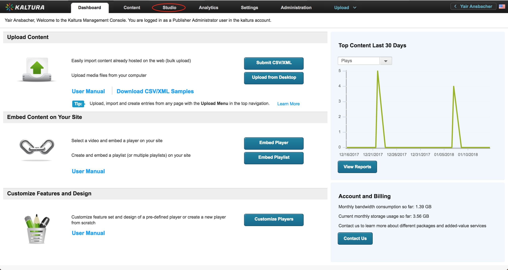

# Getting Started Guide - Using the TV Platform Player Studio to Create a Player

### Table of Contents

- [Creating a New Vidiun Player](#create)
- [Generating the Vidiun Player Embed Code](#generate)
- [Embedding the Vidiun Player into Your Website](#embed)
- [Configuring Your Player](#config)

To create a new Vidiun Player using the TV Platform Player Studio, you'll need to have an active Vidiun Management Console (VMC) account. For more information on getting an account, see [here](https://corp.vidiun.com/Products/Video-Applications/Vidiun-Video-Management-Console).

## Creating a New Vidiun Player <a name="create"></a>

1.  Open the [VMC](https://vmc.vidiun.com/index.php/vmc/vmc4#studio%7Cuniversal_studio) and select the **Studio** tab.
    

2.  Next, select **TV Platform Player Studio**.
    
    <br>This displays a list of available players, including the players you've already created.

3.  To create a new player, click **Add New Player**.
    
    <br>After creating the new player, you can customize it using the Studio; however, for now, creating a player with the default settings is enough.<br>

4.  Call the new player _"My first Vidiun Player"_ and click **Save Player Settings**.
    

That's it - you've created a new Vidiun Player.

## Generating a Vidiun Player Embed Code <a name="generate"></a>

1.  To generate an embed code, go to the **Content** tab, where you can manage your loaded entries, playlists, etc.
    

2.  Select the entry you wish to embed, open the _Select Action_ dropdown and select **Preview & Embed**.
    
    <br>Here you can choose the player you want to use in the embed code as well as the embed type - Auto, Dynamic or iframe. See [Embed Code Types](./embed-types.md) for more information.<br>

3.  From the player list, select _My first Vidiun Player_, which is the player you just created.
4.  Click **Show Advanced Options > Dynamic Embed**.
5.  Click **Copy** to copy the embed code to the clipboard.
    

## Embedding the Vidiun Player into Your Website <a name="embed"></a>

1.  First, create a simple html file:

```html
<!DOCTYPE html>
<html>
<head>
  <meta charset="utf-8">
  <meta http-equiv="Content-Type" content="text/html; charset=utf-8"/>
<head>
<body>
</body>
</html>
```

2.  Add a `div` element for the player (the `id` must be compatible with the `targetId` of the embed code):

```html
<!DOCTYPE html>
<html>
<head>
  <meta charset="utf-8">
  <meta http-equiv="Content-Type" content="text/html; charset=utf-8"/>
<head>
<body>
  <div id="my-player" style="width: 640px;height: 360px"></div>
</body>
</html>
```

3.  Paste the embed code from the clipboard to the `body`:

```html
<!DOCTYPE html>
<html>
<head>
  <meta charset="utf-8">
  <meta http-equiv="Content-Type" content="text/html; charset=utf-8"/>
<head>
<body>
  <div id="my-player" style="width: 640px;height: 360px"></div>
  <script type="text/javascript" src="http://www.vidiun.com/p/2196781/embedPakhshkitJs/uiconf_id/41483031"></script>
  <script type="text/javascript">
  try {
    var config = {
      targetId: "my-player",
      provider: {
        partnerId: 2196781,
        uiConfId: 41483031
      }
    };
    var vidiunPlayer = VidiunPlayer.setup(config);
    vidiunPlayer.loadMedia({entryId: '1_aoofesd2'});
  } catch (e) {
    console.error(e.message)
  }
  </script>
</body>
</html>
```

**You now have an embedded player in your website.**

## Configuring the Player <a name="config"></a>

After creating a player and embedding it in your site, you may want to configure it using the wide range of configuration options. To learn more, see player [configuration](./configuration.md).
